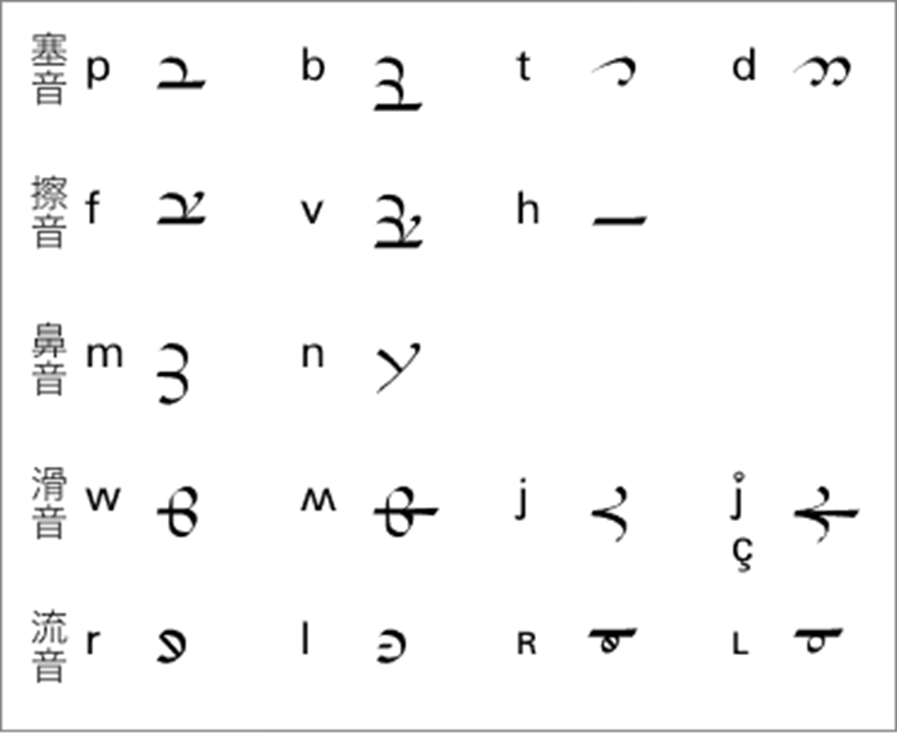
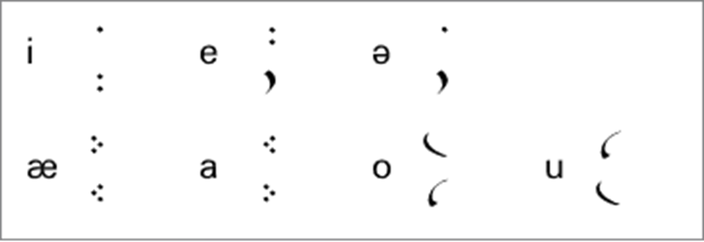
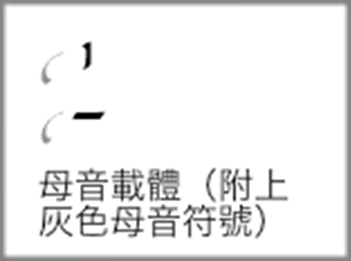
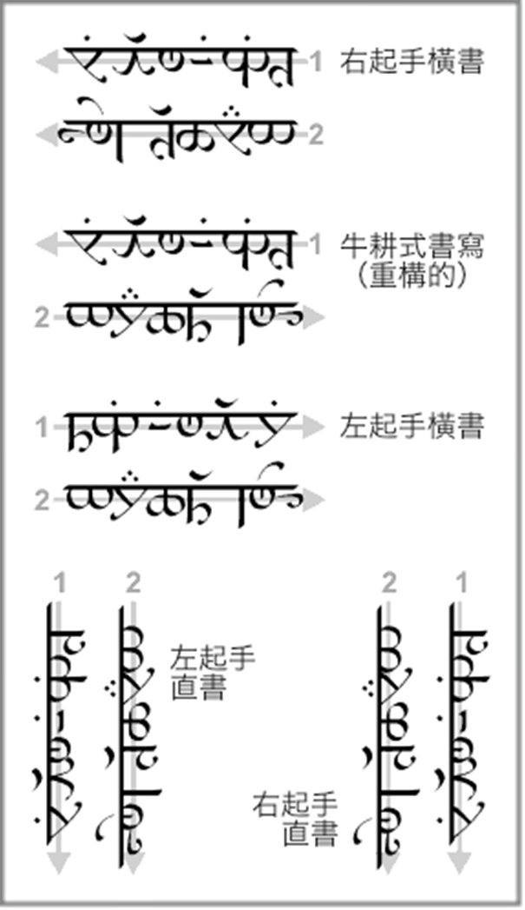
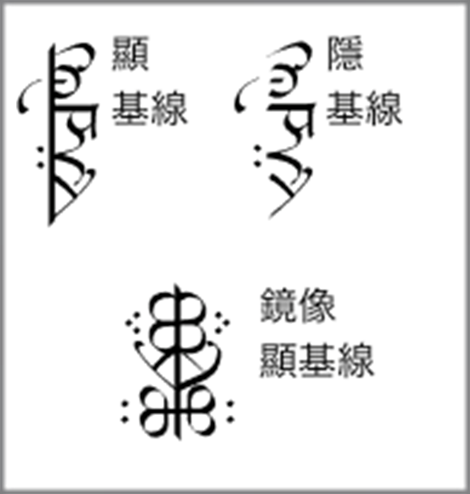
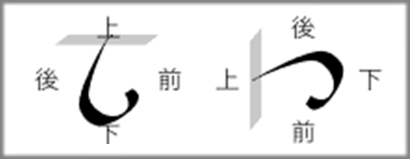
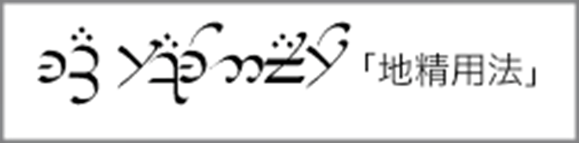
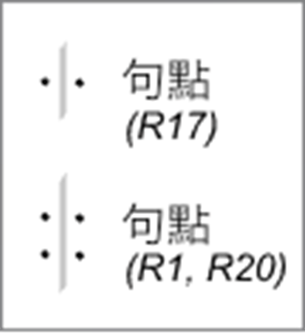

## 2 儒米爾的薩拉提文字

維林諾的儒米爾於維拉紀元 (the Valian Year) 一一七九年發明了阿爾達 (Arda) 最早的文字 [AAm]。有時托爾金將該文字粗略的叫做 The Tengwar of Rúmil [AppE]、但它的準確名字是薩拉提 (Sarati) 文字（每個字母稱爲一個 sarat ）[QE]。

### 字母

薩拉提文字是一種表音文字、每個字母都具有一個對應的音値。其音値比騰格瓦文字的音値更加固定、因此薩拉提文字是真正意義上的「字母文字」——從多個角度來說皆是如此。

在薩拉提文字中、幾乎所有可發的音都有對應的字母標示、因此它在一份文獻中被稱爲「通用埃爾達語字母」[R15]。沒有一段薩拉提文本使用了所有存在的字符、僅需使用適合於行文語言的特定字符。

#### 子音

儒米爾是一位熟練的語言學家、而薩拉提文字建立在他所處時代通行的語言學和語音學理論基礎之上。在傳統精靈語音學中、母音被視爲改變子音發音的「修飾」音素、而非完整的音素 [FQD]。

因此、僅有子音以完整的字母寫出。而元音被以附標（tehtar 一詞從未被用於描述薩拉提文字的附加符號、故此處不用該詞）的形式表示。 根據書寫語言的不同、元音附加符號加在之前或之後的輔音字母上。而一些輔音變音（如長音・續 /s/・前接的同系鼻音）亦以附標表示。

一些文獻表明薩拉提字母的形狀有過較大改動 [R12, R17]。而樣本證實了這一觀點。事實上、如圖 2-1 所示、不同樣本中僅有少量字符是一致的、即使這些字符的形狀略有不同。在不同例文中存在著它們的變體。（音値以國際音標標註）

値得注意的是、薩拉提文字的樣本是托爾金在幾十年間陸續寫成的、而在此期間他不斷的創造出新的字形。要確定這些變化在何種程度上代表了薩拉提文字理論的變化、以及它們是否表示文字本身的巨變並不容易。

（圖 2-1　始終使用的薩拉提字母）

 

在薩拉提轉寫英文的例文中、無論現代英語的音値如何、拉丁字母 R 總是轉寫爲薩拉提字母 r。因此 their 和 through（早期形式）、care 和 great（語音式）、earth 和 bread（晚期形式）中的 R 都轉寫作 Sarati 字母 r。

#### 母音

母音附標的使用通常沒有較大差異、僅僅存在相近音素間符號的對調。圖 2-2 展示了常見的母音附標及其音値。

（圖 2-2　薩拉提母音附標）

 

母音附標總是朝向所附字母的同側。圖 2-2 顯示了附於字母左側時的形狀（一般情況）。當其置於文字右側時、其形狀將被顛倒或「鏡像」。

當沒有相鄰子音供母音附標安放時、母音附標被置於**載體**上。載體通常爲直線形、與書寫方向平行或垂直。長元音有時用特殊的載體來表示、但通常以雙寫附標表示。

 

由 FQD 可知、在費艾諾時代之前、短直線形的母音載體源自表示原始埃爾達語中 [ɣ] 的薩拉提字母。理論上昆雅語母音前一定有子音、那些沒有前接子音的母音事實上是前接的子音在語言演變中消失了。濁擦音 [ɣ] 是這種子音之一。這個音存在於原始埃爾達語中、但在昆雅語中消失。當書寫的語言存在此音時、以其他字母表示。

### 書寫方向

 

根據 R17、薩拉提

> 最初是**從右向左**書寫、或者以牛耕式轉行書寫法（從右向左與從左向右交替書寫）書寫。但是在書籍和草體中、它通常是右起手直書、而亦存在左起手直書。

大部分樣本確係直書、但多數多行樣本實際上爲**左**起手直書、而非右起手。還有一些樣本是像拉丁字母一樣橫書的。

因此、以下是有例證書寫方向（括號中給出參考樣本）：

- 右起手橫書 [R17, RV1b]
- 牛耕式書寫
- 左起手橫書 [R16, R19b, R21]
- 右起手直書 [R17]
- 左起手直書 [R1, R2, R20, R22, RV1a]

精靈的雙手同樣靈活、因此他們可以用兩隻手寫出同樣美觀的文字。右起手書寫時、他們會使用左手、反之則用右手、以免遮住剛剛寫好的文本。[EHFN]

#### 基線

多數樣本的基線同 R17提到的一致：

> 在書籍中使用薩拉提文字時、所有字母都懸在一根基線上。這根基線被筆直且連續的寫出、並且子音置於基線之右（或橫書時的下）、母音置於基線之左（或橫書時的上）[R17]

但許多樣本 [R1, R16, R20, R22, R23, RV1a] 並未寫出基線、而其中一些樣本包括存在基線的獨立文段。目前尚不清楚這些樣本是否證明「書籍用法」與其他用法存在區別。

 

在一些短樣本中、字母與其**左**側的隱基線對齊 [R22, R23]。另外兩個例子——都是托爾金教授的名字——都是圍繞基線鏡像寫成（一度被忽略）[R22, R23]。在後一種情況下、母音符號也是鏡像的、會置於鏡像字母的底部。

無論書寫方向如何、每個字母總是以相同的方向朝向下一個字母。這意味著左起手與右起手相比、字母是互爲鏡像的。字母也總與基線同側。因此、談論一個字母的右側・左側・上部或下部是不實際的、因爲這取決於書寫方向和基線位置。

 

在本網站上提到的四個方向時、前側總是指閱讀的方向、而頂部總是指基線上方。

存在一個被稱爲地精用法 (Gnomish usage) [R21] 的特殊用法。這種用法爲橫書、母音附標方向也與一般橫書一致、但字母的方向與直書一致。

 

本網站樣本的書寫方向總是直書的、除非是用於專門說明其他內容。

### 標點

薩拉提文字罕用標點符號。雖然在對其描述中提到了許多標點、但實際使用的只有兩個（一個出現一次、另一個出現兩次）。這兩者似乎都對應於一般的句點。第一個是兩個點、寫在基線的兩側。而另一種則是把點加倍。

 

### 擬音

與每個字母對應的發音稱爲擬音 (valuation)。關於薩拉提音値的詳細說明可以在[薩拉提擬音](2.1.薩拉提擬音.md)一節中找到。