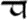
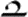
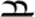

### 薩拉提擬音

以下是對薩拉提不同擬音的簡單分類。被歸於同種擬音的樣本之間依舊存在差異、但較不同擬音間的差異要少得多。毫無疑問、其中一些歸類是有爭議的。引號「」中的名稱是全新的稱法、其他則是托爾金用過的名字。

術語「擬音」一詞出現於 R12 中、在此出現的一張字母表被冠以「字母的通用擬音」的標題。該詞比模式 (mode) 一詞更適合描述薩拉提文字。首先托爾金從未用模式一詞描述薩拉提文字、其次是薩拉提的擬音和騰格瓦的模式之間存在著巨大的差異。其中最顯著的差異是擬音象徵著音値的歷時性演變、而模式象徵著同時期內共存的不同寫法。 

「[晚期形式 Late Foam](2.2.薩拉提晚期形式.md)」

- 特徵字符：k- 形 
- 樣本語言：英語
- 樣本：R22, R23

[語音式 Phonetic Form](2.3.薩拉提語音式.md)

- 特徵字符：k- 形  
- 樣本語言：
  - 英語 (R10, R11, R16, R18, R19, R20, R21)
  - 中古英語 (R19, R20)
  - 早期諾多語 (Goldogrin) (R10, R21)
- 樣本：R9, R10, R11, R12, R13, R14, R16, R17b, R18, R19, R20, R21, RV1

[昆雅用法 Quenya Usage](2.4.薩拉提昆雅用法.md)（語音式的變體）

- 樣本語言：昆雅語
- 樣本：R15, R17a, R17c

「日記式 Diary Foam」

- 特徵字符：k- 形 
- 樣本語言：英語
- 樣本：R7, R8

「[早期形式 Early Foam](2.5.薩拉提早期形式.md)」

- 特徵字符：k- 形 
- 樣本語言：英語
- 樣本：R1, R2

#### 薩拉提語音式
