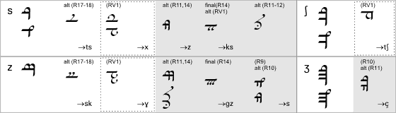
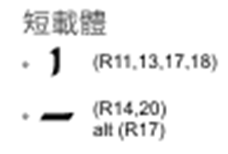

### 薩拉提語音式

樣本語言：

- 英語 (R10, R11, R16, R18, R19, R20, R21)
- 中古英語 (R19, R20)
- 早期諾多語 (Goldogrin) (R10, R21)

樣本：R9, R10, R11, R12, R13, R14, R16, R17b, R18, R19, R20, R21, RV1

#### 簡介

薩拉提語音式存在遠多於其他擬音的樣本量。但在這些樣本中僅有三份爲薩拉提文本實例 (R20, R21, RV1)。其他皆爲對語音式系統的描述、即簡單羅列薩拉提字母表和其對應音値。在這些描述中亦存在一些單詞和簡單詞組的寫法範例 (R9, R10, R11, R16, R18, R19)。

托爾金在少數樣本文檔中極其詳盡的描述了薩拉提文字的全部細節、在其中列出了大量記錄英語音値時無用的符號。因此一些變體僅出現在這些字母表中、並未有文本實例。

基於記錄特殊發音符號的不同、語音式又分爲三種變體。

- **變體一**見於 R9/R16/R20/R21。在這些樣本中托爾金列舉了不同母音附標的音値、還列出了專用於 [kw]/[gw] 和雙脣擦音（[φ]/[β]）的字符。變體一的樣本的時間從一九二一年到一九二四年或更晩、這遠早於另外兩種變體。

- **變體二**見於 RV1。該變體同變體一的差異在於其部分字母的音値和諸如早期形式之類的更早的擬音相同（特別是齦後擦音 [ʃ]）、而另一部分字母的發音又承接了晚期形式的發音（例如 [s]/[z]/[ŋ]）。綜合其他證據、這份文檔的時間有很大可能不早於一九二三年、儘管這不能證明其於其他變體之間的時間關係。

- **變體三**見於 R17b 和 R18。於前者該擬音被稱爲「語音式」以和同文檔出現的「昆(Qen)雅(ya)用法」相區別。此種變體最顯著的特徵是專用於 [kw]/[gw]・雙脣擦音的字母、和一個獨特的母音附標音値。該變體與變體一另外的區別在於變體三的文檔被精心完成、罕見修正和校訂的痕跡、而變體一的文檔相當粗糙、有明顯的修訂痕跡。變體三的兩份文檔皆來自於一九二四年及以後。

由以上描述可以得知、變體三或許纔是「正統」語音式。

#### 子音

圖 2.3-1 給出了語音式使用的字母。在每格左上角以國際音標標出音値、緊接著音値的是最常用的字母或變體三使用的字母。標註 alt 的爲可選的變體字母、標註 final 的僅用於詞尾、標註 error? 的可能爲托爾金的筆誤。箭頭指向的音標爲該字母亦表示的音。僅在變體一使用的字母以灰色背景表示、僅在變體二使用的字母以點框表示。

（圖2.3-1　薩拉提語音式子音字母）

（2.3-1.1　塞音）

（2.3-1.2　有絲擦音）

（2.3-1.3　無絲擦音）

（2.3-1.4　鼻音）

（2.3-1.5　半母音・滑音）

（2.3-1.6　流音）

（2.3-1.7　子音簇）

##### 子音修飾

薩拉提語音式以附標表示雙子音・長子音、前接鼻音、鄰接 [s]/[z]。

**雙子音・長子音**以字母下兩點或一條短線來表示（R18 中的附標模糊不清、這可能是潦草的書寫兩點導致其相連成線、或因其他原因導致）。需要注意這個附標有時會和寫於字母下部的母音附標 [e]/[i] 形態一致（見下文母音部分）。

在 R10/R11 中、雙子音以置於字母上或下部的平行於基線的直線表示。根據寫法不同、將母音附標置於字母和表示雙子音的直線間可能表示母音在兩個相同子音之間。但變體三中這樣的直線被用於表示長母音。

**前接同發音部位鼻音**（如 [p]/[b] 前的 [m]、[t]/[d] 前的 [n]、[k]/[g] 前的 [ŋ]）以杯狀符號置於字母下部表示。

在變體三中、**前接 [s]/[z]** 以兩個小短橫置於字母後部表示、**後接 [s]/[z]** 以鉤狀符號置於字母前部表示。

在變體一・變體二中、**鄰接 [s]/[z]** 以下圖所示特別符號表示。

#### 母音

在薩拉提語音式中、母音以圖 2.3-2 所示附標表示。由 R17 所述、「依據用法的不同」、語音式的母音附標既能置於其前接的子音上部、又能置於其後接的子音上部。而在大部分樣本中母音被置於其後接的子音上、僅有 R19（及少量 RV1）反之。在 R20 中、母音同時可被置於字母下部、此時表示該母音位於該字母後。

（圖 2.3-2　薩拉提語音式母音附標）

灰色背景表示該寫法僅限於變體一・二、箭頭指向的音標爲該字母亦表示的音。

如圖 2.3-2 所示、在 R11 中存在大量用於區分 e/o 半開・半閉發音的附標。

當沒有合適字母附加母音附標時、母音附標被置於短載體上部（少數情況爲下部）。短載體爲一條短直線、在語音式中通常平行於基線、但少數文本中的短載體是垂直於基線的。R17 將這種垂直寫法表述爲可選形式。

在英語薩拉提文本中、非重讀短母音（通常爲央母音 schwa [ə]）一般不明確標出。在常見的單音節詞中、母音常常不標、例如 as (R20 的中古英語文本亦是如此)/the/at/of/are/is。依據 R17、在一種語音式的變體中、未標記母音附標的字母默認後接一個譬如 [a]/[ə] 的固定母音（譯註：參考藏文字等婆羅米文字的做法）。在這樣的變體中、字母下部加一點來表示其未後接母音。已知的語音式樣本沒有如此寫成的、但薩拉提文字昆雅用法和[騰格瓦古典模式]都是如此。

##### 長母音

（圖 2.3-3　薩拉提語音式長母音）

灰色背景表示該寫法僅限於變體一・二。

長母音以圖 2.3-3 所示方法書寫。可以看出變體三表示長母音的基本方式是在字母上部（譯註：同時也是母音附標下部、既字母和母音附標之間）加一條短直線來表示（而在 R11 中這個附標表示子音重複）

變體一和變體二中存在其他表示長母音的寫法。長母音 [i:]/[u:] 透過將其母音附標置於字母 [j]/[w] 之上來表示。字母 [h] 則被用作長母音載體。

長母音亦可以雙寫母音附標的形式表示。當母音置於其後接的子音上時、長母音在前接子音下部再次書寫 [R20]。當母音置於其前接的子音上時、可透過在該該子音上下同時書寫母音附標的方式表示長母音、儘管缺乏如此書寫的樣本。値得注意的是、母音 [e]/[i] 的附標和表示雙子音的附標完全相同、皆爲兩點、但後者總是置於字母下部。

以上所有表示長母音的方法都在早期形式或晚期形式的擬音中出現過（參見[早期形式]・[晚期形式](2.2.薩拉提晚期形式.md)）

在 R14 中存在一個特殊的英語母音表示形式、但其晦澀且殘缺、故在此略過。這種形式的特點是長母音使用表示後 [ʀ]/[ʟ] 的字母作爲載體以區別於短母音。

##### 雙母音

語音式有兩種表示雙母音的方法。

對於降閉雙母音、第一個母音以母音附標書寫、第二個母音以其對於半母音的字母書寫——前母音 [ɪ] 寫作字母 [j]、後母音 [ʊ] 寫作字母 [w]。

第二種寫法是將雙母音視爲兩個連續的母音。對於央雙母音、其爲唯一存在例證的寫法。根據 R18、第一個母音寫在母音載體的上部、第二個母音寫在同一載體的下部。在更早的文獻（屬於變體一）中暗示雙母音的第一個母音寫在前接的字母下部、第二個母音寫在後接的字母上部、但這種寫法無例證。R20 的中古英語文本將雙母音的兩個母音附標都置於字母上部、但第一個母音符號放在離字母較近的位置（參看圖 2.3-4 中 ea 的寫法）。

在 R10/R11 中、音簇 [ɪu]（如 use 中的 u）以單個附標書寫、該附標是 [u] 的附標和字母 [j] 的鏡像寫法的合寫形式。

圖 2.3-4 給出存在例證的雙母音寫法。

譯註：降雙母音指前一母音比後一母音更重讀、閉雙母音指前一母音比後一母音更閉（口的張開更小）、央雙母音指後一母音比前一母音更央化。

（圖 2.3-4　薩拉提語音式的雙母音）

#### 樣本文字

使用上述語音式書寫的文本如下圖所示：

Of the Valar and their kindred

At the beginning Ilúvatar, that is Allfather, made all things, and the Valar, or Powers, came into the world. These are nine: Manwe, Ulmo, Aule, Orome, Tulkas, Osse, Lórien, Mandos, and Melko.

Orome [and Tulkas] wǽron gingran on Ealfæderes geþohtum acende ǽr þǽre worolde gescepennisse þonne óþre fífe, [and] Orome wearð Iafannan geboren, séo þe wyrð æfter nemned, ac he nis Aules sunu.

— Rúmil, fragment from The Annals of Valinor, partially translated (by Ælfwine?) to Old English

