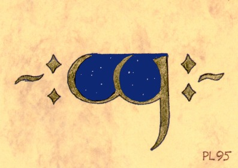

### 騰格瓦泥金裝飾

此處收集的泥金手稿應能更好展示騰格瓦書法之美。感謝 Per Lindberg 對其作品的授權。

***Man Cenuva Fána Cirya***, Måns Björkman, 2000, 21×30 cm, Ink and watercolour.

***Ilu Ilúvatar En Káre***, Måns Björkman, 1999, 25×34 cm, Ink and watercolour.

***Anga***, Per Lindberg, 1995, 7×11 cm, Gold and gouache on marble paper.

***Elbereth Gilthoniel***, Per Lindberg, 1995, 17×23 cm, Ink and gold on marble paper.

***Namárie***, Per Lindberg, 1995, 21×30 cm, Ink and gold on florales paper.